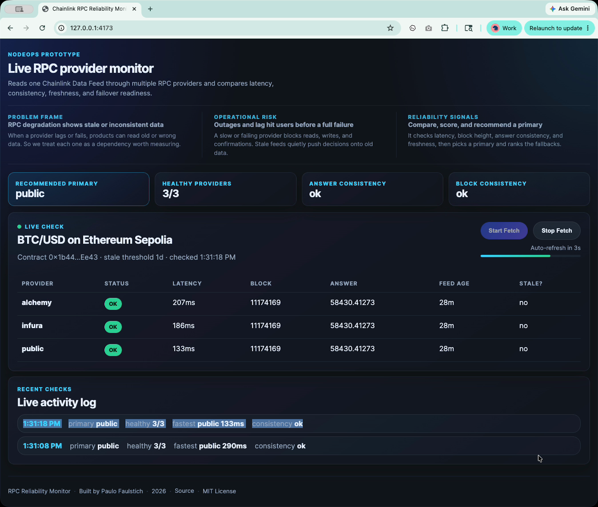

# RPC Reliability Monitor

A live monitor that reads one Chainlink Data Feed through multiple RPC providers and compares
latency, consistency, freshness, and failover readiness — treating RPC providers as
operational dependencies rather than commodity APIs.

When a provider degrades, Web3 products can read stale or inconsistent data long before it
looks like a full outage. This project measures providers side by side, scores their health,
and recommends a primary provider with ranked fallbacks.

## Demo

[](assets/demo.mp4)

▶ **[Watch the demo](assets/demo.mp4)** — the live dashboard querying multiple RPC providers,
comparing latency and freshness, and recommending a primary with fallbacks.

## Two parts

- **[`prototype/`](prototype)** — the runnable project. A CLI and a live dashboard that read a
  Chainlink BTC/USD feed on Ethereum Sepolia through multiple RPC providers — such as Alchemy,
  Infura, and a public node — using raw JSON-RPC, comparing latency, block height, answer, and
  feed freshness. Any endpoint can be configured; the tool is provider-agnostic.
- **[`pm-operating-model/`](pm-operating-model)** — the product-management artifact chain behind
  it: problem frame, hypotheses, PRD, epics, metrics, roadmap, and tech spec.

The prototype is the **executable spec** for the operating model. The narrative runs
**prototype → evidence → spec**.

## Quick start

```bash
cd prototype
cp .env.example .env   # add your RPC provider URLs
npm run dashboard      # http://localhost:4173
# or
npm run monitor        # one-off CLI run
```

No dependencies are required — the prototype uses raw JSON-RPC so the infrastructure behavior
stays visible.

## What it surfaces

- Recommended primary provider and ranked fallbacks.
- Per-provider latency, status, and block height.
- Answer and block consistency across providers.
- Feed freshness and stale-data detection.

See [`prototype/README.md`](prototype/README.md) for full details and
[`pm-operating-model/`](pm-operating-model) for the product thinking.

---

Built by [Paulo Faulstich](https://github.com/paulo-faulstich) · 2026 · [MIT License](LICENSE)
